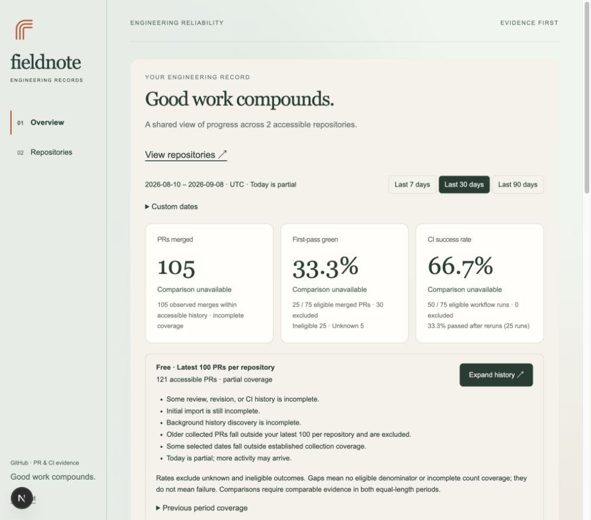

# fieldnote

**Monitor what your coding agents actually do. Act on it. Train them on it.**

Evidence-first analytics for AI-written pull requests. Every number is
recomputed from GitHub facts and replays identically. There are no LLM judges
anywhere in the pipeline.

[](https://github.com/pierrederval/ai-metrics/actions/workflows/ci.yml)
[](LICENSE)
[](package.json)



## Why

Your coding agents open pull requests. CI turns green. You merge.

Green does not mean the agent fixed the bug. Sometimes it weakened the
assertion, raised the timeout, or edited the test until the test agreed with
the code. In every dashboard you already own, that pull request looks exactly
like a good one.

fieldnote reads the revision history and tells you which one it was.

## Monitor · Act · Train

**Monitor** — _shipped._ Reconstruct pull-request and CI history from GitHub,
then recompute deterministic metrics over it. Raw webhook deliveries are kept
for provenance, normalized into queryable facts, and projected into metrics by
a pure analyzer. Same facts plus same gate policy always produce the same
numbers.

**Act** — _scoring shipped, pull requests next._ Grade a repository on how
workable it is for an agent: agent instructions, README, docs, documented setup,
documented tests. Each failing check already records what is missing and the
exact paths and line ranges that prove it. The next step is opening the pull
request that fixes it.

**Train** — _designed._ Serve a repository's own record back to the coding
agent over MCP, so the agent reads its history before it starts work rather
than after review. The metrics that answer _"what do I keep getting wrong
here?"_ are already computed; what is missing is the server that speaks them.

See [docs/roadmap.md](docs/roadmap.md) for what Act and Train require and what
they reuse.

## What it measures

| Metric                            | Definition                                                                                                                                 |
| --------------------------------- | ------------------------------------------------------------------------------------------------------------------------------------------ |
| **Clean Green**                   | Eventually green **and** the harness was not changed after failure. The headline number.                                                   |
| **Harness Changed After Failure** | A test, CI, runner, quality, or package-configuration file changed on a later revision, after failed CI and through the first green state. |
| **First Pass Green**              | Every configured gate's first execution on the first evaluated SHA succeeded.                                                              |
| **Eventually Green**              | Some SHA reached a simultaneous, complete, successful state.                                                                               |
| **Attempts to Green**             | One-based SHA index of the earliest chronological green state.                                                                             |
| **Time to Green**                 | Interval from the first relevant execution start to that green state.                                                                      |
| **Failed Check Count**            | Terminal failed required executions. Deduplicated by producing App and exact check name for the unique count.                              |
| **Agent readiness**               | Repository score out of 100 across five documentation and instruction checks, with per-check file and line evidence.                       |

Outcomes stay `null` when the gate policy is unconfigured, relevant work is
still pending, or historical evidence cannot support the claim. Aggregate rates
exclude unknown values and always show their denominators, so missing evidence
is never silently counted as either failure or success.

## Try it in 60 seconds

No GitHub App required. The seeded demo is repeatable and contains 21 pull
requests.

```bash
pnpm install
cp .env.example .env
docker compose up -d --wait
pnpm db:migrate
pnpm db:seed
pnpm dev
```

Open [http://localhost:3000/dashboard](http://localhost:3000/dashboard).

Look at PR `demo-pr-4`: failed CI, then a change to a test file, then successful
CI, and therefore **Clean Green = No**. That single PR is the whole thesis.

Requires Node.js 24+, pnpm 10.27+, and Docker with Compose (or PostgreSQL 17+).

The checked-in `.env.example` enables development-only demo mode. The
application refuses demo mode when `NODE_ENV=production`.

## How it works

1. A GitHub App receives webhook deliveries; every raw delivery is stored first.
2. Deliveries and backfill are normalized into facts: pull requests, revisions,
   CI runs, checks, and changed files, each carrying how it was observed.
3. A revision comparison is trusted for harness attribution only when GitHub
   reports the previous SHA as the merge base and the file list is complete.
   Cumulative diffs are never attributed to a single repair commit.
4. A pure analyzer projects facts plus an immutable, versioned gate policy into
   metrics. Nothing in this step calls a model or the network.
5. Durable workers (Inngest) handle import, backfill, and recovery.

Full detail in [architecture.md](docs/architecture.md) and
[domain-model.md](docs/domain-model.md).

## Status

|                                         | State               |
| --------------------------------------- | ------------------- |
| PR and CI ingestion, backfill, recovery | Shipped             |
| Deterministic metrics and dashboards    | Shipped             |
| Team workspaces and invitations         | Shipped             |
| Repository agent-readiness grading      | Shipped             |
| Act — opening readiness pull requests   | Designed, not built |
| Train — MCP server for coding agents    | Designed, not built |

Known limits are recorded in [validation.md](docs/validation.md), and
deliberately excluded work in [future.md](docs/future.md). Free access shows the
latest 100 pull requests per repository.

## Documentation

- [Architecture](docs/architecture.md) — how the pieces fit
- [Domain model](docs/domain-model.md) — facts, metrics, and the tables behind them
- [Roadmap](docs/roadmap.md) — Act and Train
- [Operations](docs/operations.md) — tests, CI, production config, operator commands
- [GitHub App setup](docs/github-app.md) — running against real repositories
- [Validation and limitations](docs/validation.md) — what these numbers do not claim
- [Deferred work](docs/future.md)

## Contributing

Contributions are welcome. See [CONTRIBUTING.md](CONTRIBUTING.md) for setup, the
five CI gates every pull request must pass, and what a good change looks like
here.

## License

[AGPL-3.0](LICENSE). You may self-host, modify, and use fieldnote freely. If you
run a modified version as a network service, you must publish your changes.
